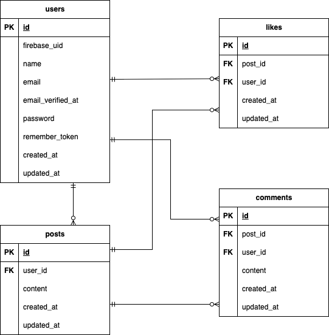

# SHARE-app

Twitter 風のソーシャルメディアアプリケーションです。ユーザー同士で短いメッセージ（投稿）を共有し、いいねやコメント機能を通じてリアルタイムでコミュニケーションを取ることができるプラットフォームです。Firebase 認証を使用したセキュアなユーザー管理とバリデーション機能により、安全で使いやすい SNS 体験を提供します。

## 作成した目的

現代の SNS の基本機能を理解し、実際に動作するアプリケーションを開発することで、フルスタック開発のスキルを習得することを目的としています。特に、Vue.js/Nuxt.js と Laravel/MySQL を組み合わせたモダンな開発環境での実装経験を積むため、また Firebase 認証の導入やフロントエンド・バックエンド間の API 連携を学ぶため、Twitter 風の機能を持つアプリケーションを作成しました。

## 他のリポジトリ

このリポジトリにフロントエンド（Nuxt.js）とバックエンド（Laravel）の両方が含まれています。

## 機能一覧

**認証機能**

- ユーザー認証（Firebase Authentication）
- 新規登録機能（ユーザーネーム、メールアドレス、パスワード）
- ログイン機能（メールアドレス、パスワード）
- ログアウト機能

**投稿機能**

- 投稿の一覧表示、追加処理、削除処理
- 投稿した名前と投稿内容が表示される
- 投稿の追加（120 文字以内）
- バツマークを押すと投稿が削除される

**いいね機能**

- ハートマークを押すといいね数が増えたり減ったりする

**コメント機能**

- 矢印マークを押すとコメント画面に遷移する
- コメントした名前と投稿内容が表示される
- コメントの追加（120 文字以内）

## 使用技術（実行環境）

**フロントエンド**
- Vue.js 3.5.18
- Nuxt.js 3.27.0
- Node.js 20.19.4

**バックエンド**
- Laravel 8.83.8
- PHP 7.4.9
- MySQL 8.0

**Webサーバー**
- nginx 1.21.1

**認証**
- Firebase Authentication

**開発環境**
- Docker
- Docker Compose
- phpMyAdmin


## テーブル設計

### users テーブル

| カラム名          | データ型        | 制約             | 説明                 |
| ----------------- | --------------- | ---------------- | -------------------- |
| id                | unsigned bigint | PRIMARY KEY      | ユーザー ID          |
| firebase_uid      | varchar(255)    | UNIQUE           | Firebase 認証 ID     |
| name              | varchar(255)    | NOT NULL         | ユーザー名           |
| email             | varchar(255)    | UNIQUE, NOT NULL | メールアドレス       |
| email_verified_at | timestamp       |                  | メール認証日時       |
| password          | varchar(255)    |                  | パスワード           |
| remember_token    | varchar(100)    |                  | ログイン保持トークン |
| created_at        | timestamp       | NOT NULL         | 作成日時             |
| updated_at        | timestamp       | NOT NULL         | 更新日時             |

### posts テーブル

| カラム名   | データ型        | 制約                  | 説明        |
| ---------- | --------------- | --------------------- | ----------- |
| id         | unsigned bigint | PRIMARY KEY           | 投稿 ID     |
| user_id    | unsigned bigint | FOREIGN KEY, NOT NULL | ユーザー ID |
| content    | text            | NOT NULL              | 投稿内容    |
| created_at | timestamp       | NOT NULL              | 作成日時    |
| updated_at | timestamp       | NOT NULL              | 更新日時    |

### likes テーブル

| カラム名   | データ型        | 制約                  | 説明        |
| ---------- | --------------- | --------------------- | ----------- |
| id         | unsigned bigint | PRIMARY KEY           | いいね ID   |
| post_id    | unsigned bigint | FOREIGN KEY, NOT NULL | 投稿 ID     |
| user_id    | unsigned bigint | FOREIGN KEY, NOT NULL | ユーザー ID |
| created_at | timestamp       | NOT NULL              | 作成日時    |
| updated_at | timestamp       | NOT NULL              | 更新日時    |

### comments テーブル

| カラム名   | データ型        | 制約                  | 説明         |
| ---------- | --------------- | --------------------- | ------------ |
| id         | unsigned bigint | PRIMARY KEY           | コメント ID  |
| post_id    | unsigned bigint | FOREIGN KEY, NOT NULL | 投稿 ID      |
| user_id    | unsigned bigint | FOREIGN KEY, NOT NULL | ユーザー ID  |
| content    | text            | NOT NULL              | コメント内容 |
| created_at | timestamp       | NOT NULL              | 作成日時     |
| updated_at | timestamp       | NOT NULL              | 更新日時     |

## ER図



## 環境構築
**Dockerビルド**
1. `git clone git@github.com:ichiki925/SHARE-app.git`
2. DockerDesktopアプリを立ち上げて、`docker-compose up -d --build` を実行

**Laravel環境構築**
1. `docker-compose exec php bash`
2. `composer install`
3. .env.exampleを.envにコピー
```bash
cp .env.example .env
```
4. .envに以下の環境変数を追加
``` text
DB_CONNECTION=mysql
DB_HOST=mysql
DB_PORT=3306
DB_DATABASE=laravel_db
DB_USERNAME=laravel_user
DB_PASSWORD=laravel_pass
```

5. アプリケーションキーの作成
```bash
php artisan key:generate
```

6. マイグレーションを実行してコンテナから出る
```bash
php artisan migrate
exit
```

**Nuxt.js環境構築**
1. `docker-compose exec nuxt-app sh`
2. コンテナ内で以下を実行
```bash
npm install
exit
```

**Firebase設定**
1. Firebaseプロジェクトの作成
- [Firebase Console](https://console.firebase.google.com/)にアクセス
- 「プロジェクトを追加」をクリックしてプロジェクトを作成
2. Firebase Authentication の有効化
- Firebase Console で作成したプロジェクトを開く
- 左メニューの「Authentication」をクリック
- 「始める」をクリック
- 「Sign-in method」タブで「メール/パスワード」を有効化
3. サービスアカウント認証情報の取得
- Firebase Console の「プロジェクトの設定」（歯車アイコン）をクリック
- 「サービス アカウント」タブを選択
- 「新しい秘密鍵の生成」をクリック
- ブラウザのダウンロードフォルダにファイルがダウンロードされる
4. 認証情報ファイルの配置
- ※ storage/app/firebase/ フォルダは事前に作成してください
- ダウンロードしたJSONファイルを探す
- そのファイルを storage/app/firebase/credentials.json として保存
5. 環境変数の設定
- Firebase Console の「プロジェクトの設定」（歯車アイコン）→「全般」タブからFirebase設定情報を取得
- Laravel側の`.env` ファイルに以下を追加：
```text
FIREBASE_PROJECT_ID=your-firebase-project-id
```
- Nuxt.js側の`.env`ファイル(`nuxt-app`ディレクトリ内)を作成し、以下の情報を追加：
```text
NUXT_FIREBASE_API_KEY=your_api_key_here
NUXT_FIREBASE_AUTH_DOMAIN=your_project.firebaseapp.com
NUXT_FIREBASE_PROJECT_ID=your_project_id
NUXT_FIREBASE_STORAGE_BUCKET=your_project.appspot.com
NUXT_FIREBASE_MESSAGING_SENDER_ID=your_sender_id
NUXT_FIREBASE_APP_ID=your_app_id
```

**重要な注意事項**
- `storage/app/firebase/credentials.json` はセキュリティ上の理由でGit管理対象外です
- APIキーなどの機密情報はGitHubにプッシュしないでください
- Firebase未設定の場合、認証機能は動作しません

**トラブルシューティング**
Firebase関連のエラーが発生する場合：
1. `storage/app/firebase/credentials.json` が存在することを確認
2. `.env` の `FIREBASE_PROJECT_ID` が正しく設定されていることを確認
3. Firebase Console でプロジェクトが正しく設定されていることを確認


## 利用方法
1. 新規登録からアカウントを作成
2. Firebase認証によりメール認証が必要
3. 認証後、投稿・いいね・コメント機能が利用可能

※Firebase認証のため、事前のテストアカウントは用意していません

## アクセスURL
- フロントエンド: http://localhost:3000
- バックエンドAPI: http://localhost:8000
- phpMyAdmin：http://localhost:8080/
